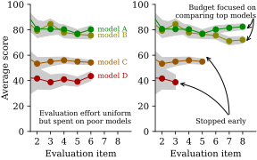

# Allocating Human Evaluation via Bandits

> **Abstract:**
> While human evaluation is the gold standard in many NLP tasks, it suffers from prohibitive costs and poor scalability.
> When identifying top-performing models, typical evaluation protocols waste effort by exhaustively evaluating all models on the entire benchmark, a safe but inefficient approach.
> In this work, we formalize multi-model human evaluation as a best-arm identification problem in a multi-armed bandit setup with correlated arms, where pulling an arm corresponds to human-evaluating a model.
> By sampling adaptively based on the intermediate model rankings obtained on the samples so far, we can focus the annotation budget on the most competitive models.
> We prove the optimality of the proposed algorithms and show that it improves discrimination between top-performing models.
> This makes evaluations faster, cheaper and more aligned with large-scale competition evaluation goals.

This repository contains experiments and analyses.
If you are interested in the annotation interface for dynamic evaluation, please see [Pearmut](https://github.com/zouharvi/pearmut).



## Experiments

Generally, only scripts in `scripts/` should be launched directly.
The code in `src/` is implementation of various algorithms and utility functions.

```bash
# install local package
pip install -e .

# run simulations (benefits from many CPU cores)
bash 02b-simulation_compute_launch.sh
bash 03b-synth_launch.sh

# run analysis and produce figures
cd scripts
# produces main figure and summary JSON to be used in Typst paper
python3 02c-simulation_plot.py
# produces secondary figure and summary JSON to be used in Typst paper
python3 03c-synth_plot.py

# examine the distributions in WMT dataset
python3 04-check_assumptions.py
# produces figure showing the allocation between oracle and other algorithms
python3 05-sampler_distribution_plot.py

# produce a zoomed-in figure for a single run
python3 10-trace_plot.py
# produce various tiny figures showing omega functions
python3 11-microplot.py
# produces figure 1
python3 12-intro_figure.py
# produces two mock figures showing the idea of the evaluation
python3 12-mock_figure.py
```

## Bibliography

```bibtex
@misc{zouhar2026dynamically,
  title={Dynamically Allocating Evaluation Effort for Model Ranking},
  author={Vilém Zouhar and Julia Kreutzer and Alon Lavie and Tom Kocmi and Matt Post and Ondřej Bojar and Mrinmaya Sachan},
  note={In preparation},
  url={https://vilda.net/papers/evaluation_bandit.pdf},
  year={2026},
}
```